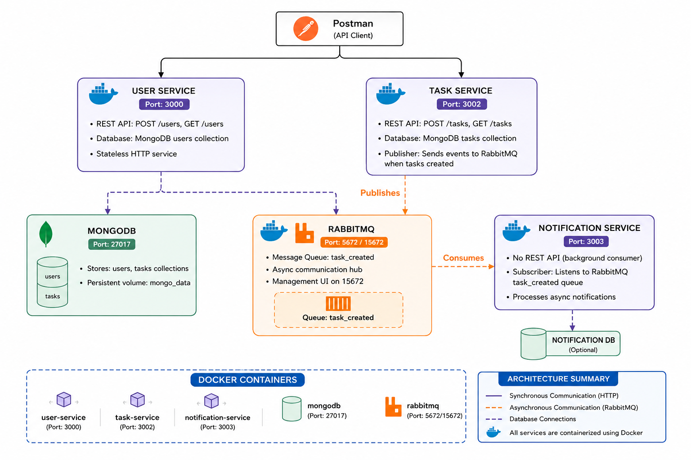

# TODO Microservices Application

Event-driven microservices for task management using Node.js, Express, MongoDB, and RabbitMQ.

## Architecture



**System Overview:**
- **User Service** (Port 3000) - User CRUD API
- **Task Service** (Port 3002) - Task CRUD API + Event Publisher  
- **Notification Service** (Port 3003) - Async Event Consumer
- **MongoDB** (Port 27017) - Data persistence
- **RabbitMQ** (Port 5672/15672) - Message queue

---

## Quick Start

### Prerequisites
- Docker & Docker Compose installed

### Run All Services

```bash
cd /Users/kumar/Desktop/TODO
docker compose up --build -d
```

### Verify Services Running

```bash
docker compose ps
```

---

## API Endpoints

### User Service (Port 3000)

```bash
# Create user
curl -X POST http://localhost:3000/users \
  -H "Content-Type: application/json" \
  -d '{"name":"John","email":"john@example.com"}'

# Get all users
curl http://localhost:3000/users
```

### Task Service (Port 3002)

```bash
# Create task (triggers async notification)
curl -X POST http://localhost:3002/tasks \
  -H "Content-Type: application/json" \
  -d '{"title":"Learn Docker","description":"Setup","userId":1}'

# Get all tasks
curl http://localhost:3002/tasks
```

---

## View Notifications

Watch notification service logs in real-time:

```bash
docker logs notification-service -f
```

When you create a task, you'll see:
```
📧 Notification: Task created - {
  taskId: '...',
  userId: 1,
  title: 'Learn Docker'
}
```

---

## Database Access

### MongoDB

```bash
docker exec -it mongo mongosh

# List databases
show dbs

# View tasks
use tasks
db.tasks.find()

# View users
use users
db.users.find()
```

### RabbitMQ Management UI

```
http://localhost:15672
Username: guest
Password: guest
```

---

## Project Structure

```
TODO/
├── docker-compose.yml
├── user-service/
│   ├── Dockerfile
│   ├── index.js
│   └── package.json
├── task-service/
│   ├── Dockerfile
│   ├── index.js
│   └── package.json
└── notification-service/
    ├── Dockerfile
    ├── index.js
    └── package.json
```

---

## How It Works

1. **Client** sends POST request to Task Service
2. **Task Service** saves task to MongoDB
3. **Task Service** publishes event to RabbitMQ
4. **API responds** immediately (201 Created)
5. **Notification Service** consumes event asynchronously
6. **Notification** is logged/processed

---

## Tech Stack

| Component | Version |
|-----------|---------|
| Node.js | 22 |
| Express | 5.2.1 |
| MongoDB | 5 |
| RabbitMQ | 3 |
| Docker | Latest |

---

## Stop Services

```bash
docker compose down
```

---

## Troubleshooting

| Problem | Solution |
|---------|----------|
| Port already in use | Change port in docker-compose.yml |
| MongoDB won't start | Delete volume: `docker volume rm todo_mongo_data` |
| RabbitMQ connection fails | Wait 15 seconds, check `docker logs rabbitmq` |
| No notifications received | Check `docker logs notification-service` |

---

**Status:** ✅ All services running and tested
